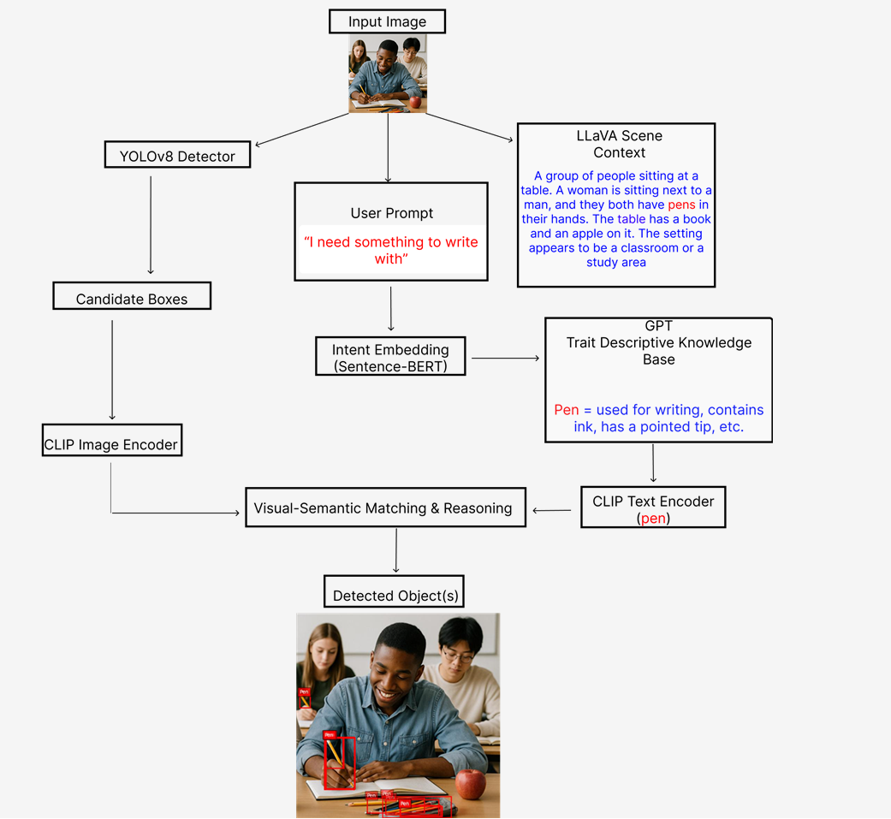

# 🧠 Commonsense-Guided Open-World Object Detection

This project combines **YOLOv8**, **CLIP**, **LLaVA**, and **GPT-4-style trait reasoning** to detect objects based on **user intent** and **scene context** — even if the object is **unseen during training**.

> Example: Prompting “I need something to write with” will match the trait group “pen/pencil” and detect it in the scene, even if it wasn’t part of YOLO’s original label set.

---

Pipeline Overview

1. **YOLOv8** generates bounding boxes.
2. **LLaVA** provides a detailed image description.
3. **User prompt** is mapped to object traits using **SentenceTransformer**.
4. **CLIP** compares region crops with the intent-driven traits.
5. Bounding boxes are filtered with **CLIP + LLaVA + commonsense** reasoning.

 <!-- Relative path, works on GitHub -->

## 🖼️ Example

📝 Prompt: `I need something to write with`

🔍 Matched group: `pen/pencil`

📦 Detected in image → `pen` with bounding box

